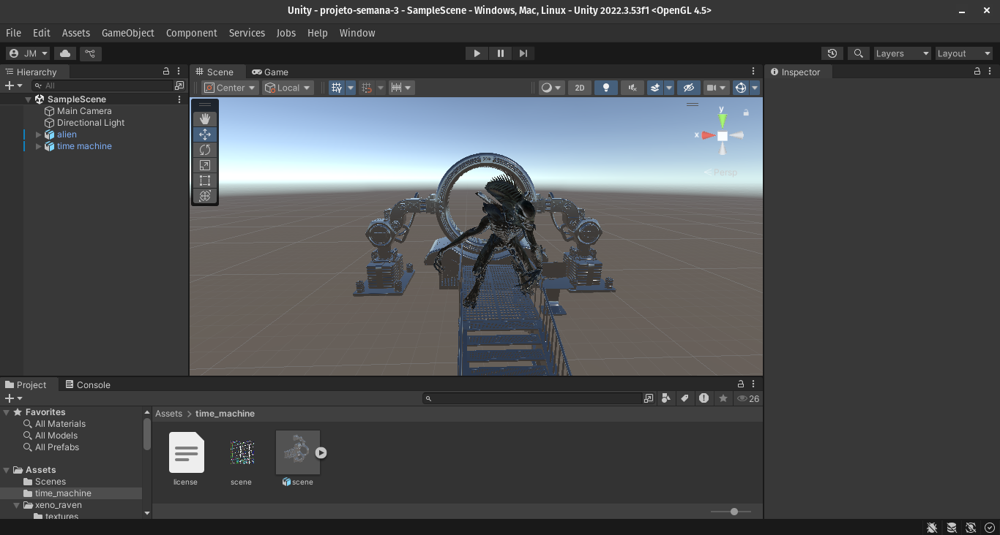

# Individual semana 3 - segunda

links dos assets usados:

- [Alien](https://skfb.ly/6ryK7)
- [Time-Machine](https://skfb.ly/ouAJU)

## Print dia 02/12 - seleção de assets e disposição na engine



#  Entrega final - Mustafar 3D Experience - A-Frame

Este projeto recria o ambiente de Mustafar, o icônico planeta vulcânico da saga *Star Wars*, usando A-Frame para renderização 3D na web. A experiência é dividida em duas cenas interativas: uma batalha entre Anakin Skywalker e Obi-Wan Kenobi, e outra destacando Darth Vader e o Imperador Palpatine, acompanhada por uma nave imperial.

## 🌋 Primeira Cena: **Batalha de Mustafar**
- **Ambiente**: Planeta Mustafar com um vulcão em erupção e fluxos de lava animados.
- **Personagens**: 
  - *Anakin Skywalker*: Posicionado no centro, destacando o conflito.
  - *Obi-Wan Kenobi*: Em oposição a Anakin.
- **Interações**:
  - Quando o cursor aponta para Anakin, a cena muda para a próxima página.
- **Áudio**: A cena é acompanhada pela famosa fala de Obi-Wan: *"It's over, Anakin! I have the high ground."*
- **Animação**: 
  - Fluxos de lava com deslocamento de textura para simular movimento.
  
## 🎵 Segunda Cena: **Ascensão de Darth Vader**
- **Ambiente**: Continuação de Mustafar, agora com um clima mais sombrio, simbolizando o domínio do Império.
- **Personagens**:
  - *Darth Vader*: Em terra firme, representando a transformação para o lado negro.
  - *Palpatine*: Posicionado próximo, reforçando seu papel como mestre.
- **Nave Imperial**: Uma nave imperial voa lentamente sobre o ambiente.
- **Interações**:
  - Quando o cursor aponta para Palpatine, a experiência redireciona para um vídeo do YouTube com a cena final de Darth Vader no *Episódio III*.
- **Áudio**: A música tema *The Imperial March* toca ao fundo.

## 🚀 Tecnologias Utilizadas
- **[A-Frame](https://aframe.io/)**: Framework de realidade virtual para a web.
- **HTML e JavaScript**: Para estrutura e comportamento das cenas.
- **GLTF/OBJ Models**: Modelos 3D para personagens, objetos e ambiente.
- **Assets**: 
  - Texturas para o céu e o solo.
  - Modelos de personagens e veículos extraídos de repositórios confiáveis.

## ⚙️ Funcionalidades Implementadas
1. **Modelos 3D**:
   - Anakin Skywalker, Obi-Wan Kenobi, Darth Vader, Palpatine e nave imperial.
2. **Animação**:
   - Deslocamento de textura da lava para simular movimento.
   - Nave imperial em movimento constante.
3. **Interações com o Cursor**:
   - Transição entre cenas ao mirar no personagem designado.
   - Redirecionamento para o YouTube na segunda cena.
4. **Áudio Imersivo**:
   - Reprodução contínua de trilhas sonoras icônicas.

## 🛠️ Como Executar o Projeto
1. Faça o download ou clone este repositório:
   ```bash
   git clone https://github.com/jeanroths/Exp-Im-M12-Individual3
   ``` 
2. Abra o arquivo `mustafar1.html` em qualquer navegador compatível com WebXR.

3. Explore as cenas e interaja com os personagens para navegar.

## Estrutura do projeto

/
├── assets/                         # Modelos 3D e texturas
├── texturas/                       # Imagens para fundo e solo
├── mustafar1.html                  # Primeira cena
├── mustafar2.html                  # Segunda cena
├── README.md                       # Este arquivo
├── Imperial-march.mp3              # Musica marcha imperial
├── I-have-the-high-ground.mp3      # Musica batalha final


